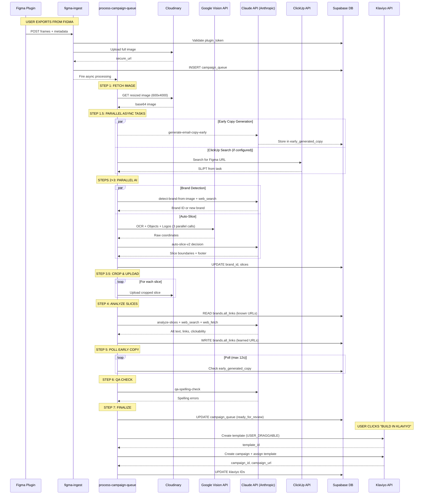

# Technical Architecture Documentation

> Complete system documentation for the email campaign processing pipeline from Figma export to Klaviyo-ready HTML.

---

## Table of Contents

1. [System Overview](#1-system-overview)
2. [User Flow: Figma Plugin Export](#2-user-flow-figma-plugin-export)
3. [Backend Processing Pipeline](#3-backend-processing-pipeline)
4. [Detailed Step Documentation](#4-detailed-step-documentation)
5. [Klaviyo Publishing](#5-klaviyo-publishing-push-to-klaviyo)
6. [AI Model Selection Strategy](#6-ai-model-selection-strategy)
7. [Cloudinary Transformation Reference](#7-cloudinary-transformation-reference)
8. [Database Operations Map](#8-database-operations-map)
9. [Sequence Diagram](#9-mermaid-sequence-diagram)
10. [Parallelization Analysis](#10-parallelization-analysis)
11. [External API Reference](#11-external-api-reference)

---

## 1. System Overview

### High-Level Architecture

```
┌─────────────────┐     ┌──────────────────┐     ┌─────────────────┐
│  Figma Plugin   │────▶│  Edge Functions  │────▶│    Supabase     │
│  (Export Tool)  │     │  (Processing)    │     │   (Database)    │
└─────────────────┘     └──────────────────┘     └─────────────────┘
                               │
                               ▼
        ┌──────────────────────┼──────────────────────┐
        │                      │                      │
        ▼                      ▼                      ▼
┌───────────────┐     ┌───────────────┐     ┌───────────────┐
│  Cloudinary   │     │  Claude API   │     │  Klaviyo API  │
│  (Storage)    │     │  (AI Models)  │     │  (Publishing) │
└───────────────┘     └───────────────┘     └───────────────┘
                             │
                             ▼
                    ┌───────────────┐
                    │ Google Vision │
                    │     API       │
                    └───────────────┘
```

### Technology Stack

| Layer | Technology | Purpose |
|-------|------------|---------|
| Frontend | React + TypeScript + Vite | Web application |
| Plugin | Figma Plugin API | Design export |
| Backend | Supabase Edge Functions (Deno) | Serverless processing |
| Database | PostgreSQL (Supabase) | Data persistence |
| Storage | Cloudinary | Image storage & transformations |
| AI | Anthropic Claude, Google Vision, Gemini | Content analysis & generation |
| Email | Klaviyo | Template & campaign publishing |

### Key Components

- **Figma Plugin**: Exports selected frames with metadata
- **`figma-ingest`**: Entry point for plugin exports
- **`process-campaign-queue`**: Main orchestration function
- **AI Functions**: Brand detection, slicing, copy generation, link analysis
- **`push-to-klaviyo`**: Template/campaign publishing

---

## 2. User Flow: Figma Plugin Export

### Export Payload Structure

```typescript
interface IngestPayload {
  pluginToken: string;           // Auth token from plugin_tokens table
  frames: FrameData[];
  subjectLine?: string;          // Optional provided subject line
  previewText?: string;          // Optional provided preview text
  brandId?: string;              // Optional pre-selected brand from dropdown
}

interface FrameData {
  name: string;                  // Frame name → becomes campaign name
  width: number;                 // Original frame width (px)
  height: number;                // Original frame height (px)
  imageBase64: string;           // PNG base64 (1x or 2x based on exportScale)
  figmaUrl?: string;             // Link to Figma file for ClickUp integration
}
```

### Export Scaling Logic

The plugin uses adaptive scaling based on frame height to balance quality vs. file size:

| Frame Height | Export Scale | Result |
|--------------|--------------|--------|
| > 3500px | 1x | Original dimensions |
| ≤ 3500px | 2x | Retina quality (doubled dimensions) |

**Rationale**: Large frames at 2x would exceed Cloudinary/API size limits, while smaller frames benefit from retina quality.

### Plugin Authentication

1. User generates a `pluginToken` in the web app (Settings page)
2. Token stored in `plugin_tokens` table with `user_id`
3. Plugin sends token with every export
4. `figma-ingest` validates token and retrieves `user_id`

---

## 3. Backend Processing Pipeline

### Pipeline Overview (8 Steps)

| Step | Function | AI Model | Est. Time | Dependencies |
|------|----------|----------|-----------|--------------|
| 1 | `figma-ingest` → `upload-to-cloudinary` | None | ~2s | None |
| 1.5 | `generate-email-copy-early` (async) | **Claude Sonnet 4** | ~8-12s | Runs async, doesn't block |
| 1.5b | `search-clickup-for-copy` (async) | **Gemini 2.5 Flash Lite** | ~2s | Optional, needs ClickUp config |
| 2 | `detect-brand-from-image` | **Claude Sonnet 4** + web_search | ~5-8s | Step 1 complete |
| 3 | `auto-slice-v2` | **Google Vision API** + **Claude Sonnet 4.5** | ~20-30s | Step 1 complete |
| 3.5 | `cropAndUploadSlices` | None (ImageScript) | ~15-25s | Step 3 complete |
| 4 | `analyze-slices` | **Claude Sonnet 4.5** + web_search + web_fetch | ~30-45s | Step 3.5 complete |
| 5 | Poll `early_generated_copy` | None | ~0-12s | Wait for Step 1.5 |
| 6 | `qa-spelling-check` | **Claude Sonnet 4** | ~3-5s | Step 1 complete |
| 7 | Merge & finalize | None | ~1s | All steps complete |
| **TOTAL** | | | **~90-120s** | |

### Status Flow

```
processing → ready_for_review → sent_to_klaviyo
     │
     └──→ error (on failure)
```

### Processing Step Tracking

The `campaign_queue` table tracks progress via:
- `processing_step`: Current step name (e.g., "auto_slice", "analyze_slices")
- `processing_percent`: 0-100 progress indicator

---

## 4. Detailed Step Documentation

### Step 1: Image Upload (`figma-ingest`)

**File**: `supabase/functions/figma-ingest/index.ts`

| Aspect | Details |
|--------|---------|
| **Input** | Base64 image from Figma plugin, metadata |
| **Output** | Cloudinary URL, campaign_queue entry created |
| **AI Model** | None |
| **Cloudinary** | Direct upload to `campaign-queue` folder |
| **DB Write** | `campaign_queue` (insert new entry) |
| **DB Read** | `plugin_tokens` (validate token), `brands` (validate brandId if provided) |

**Process**:
1. Validate plugin token against `plugin_tokens` table
2. Update `last_used_at` on token
3. Validate brand ID if provided
4. Upload image to Cloudinary via `upload-to-cloudinary`
5. Create `campaign_queue` entry with status `processing`
6. Fire async `process-campaign-queue` (doesn't wait for completion)

---

### Step 1.5: Early Copy Generation (`generate-email-copy-early`)

**File**: `supabase/functions/generate-email-copy-early/index.ts`

| Aspect | Details |
|--------|---------|
| **Input** | Campaign image URL, brand context (optional) |
| **Output** | 10 subject lines, 10 preview texts, spelling errors |
| **AI Model** | `claude-sonnet-4-20250514` |
| **Cloudinary** | `c_limit,w_600,h_7900` transformation (under 8000px limit) |
| **DB Write** | `early_generated_copy` (upsert by session_key) |
| **DB Read** | `brands` (if brand_id provided) |

**Key Features**:
- **Fire and Forget**: Called asynchronously, doesn't block main pipeline
- **Session Key**: Uses image URL's Cloudinary public ID as unique key
- **Chunked Base64**: Processes large images in 32KB chunks to avoid stack overflow
- **Expiration**: Results expire after 1 hour

**Prompt Focus**:
- Generate 10 diverse subject lines (varying length/style)
- Generate 10 preview texts that complement subject lines
- Flag obvious spelling errors in the image

---

### Step 1.5b: ClickUp Copy Search (`search-clickup-for-copy`)

**File**: `supabase/functions/search-clickup-for-copy/index.ts`

| Aspect | Details |
|--------|---------|
| **Input** | Figma URL, ClickUp API key, list ID |
| **Output** | Subject line, preview text from matched task |
| **AI Model** | `google/gemini-2.5-flash-lite` (via Lovable AI Gateway) |
| **External API** | ClickUp API v2/v3 |
| **DB Read** | `brands` (ClickUp credentials) |

**Process**:
1. Extract Figma file key from URL
2. Search ClickUp list for tasks containing the Figma URL
3. If found, use Gemini to extract subject line and preview text from task content
4. Return structured copy data

**Conditional**: Only runs if brand has ClickUp integration configured.

---

### Step 2: Brand Detection (`detect-brand-from-image`)

**File**: `supabase/functions/detect-brand-from-image/index.ts`

| Aspect | Details |
|--------|---------|
| **Input** | Campaign image base64, existing brands list |
| **Output** | Matched brand ID or new brand info (name, domain, colors) |
| **AI Model** | `claude-sonnet-4-20250514` with `web_search_20250305` tool |
| **DB Read** | `brands` (all user brands for matching) |
| **DB Write** | None (brand_id written by orchestrator) |

**Process**:
1. Fetch all existing brands for the user
2. Send image to Claude with brand list
3. Claude uses web search to identify brand from logos/text
4. Returns either matched brand ID or new brand suggestion

**Beta Header**: `web-search-2025-03-05`

---

### Step 3: Auto-Slice (`auto-slice-v2`)

**File**: `supabase/functions/auto-slice-v2/index.ts`

| Aspect | Details |
|--------|---------|
| **Input** | Campaign image base64 |
| **Output** | Slice boundaries (yTop, yBottom), footer detection, horizontal splits |
| **AI Models** | Google Cloud Vision API (3 parallel calls) + Claude Sonnet 4.5 |
| **Cloudinary** | Image resized to max 7900px height before Claude API |

**Google Vision API Calls** (parallel):

| Detection Type | Purpose |
|----------------|---------|
| `DOCUMENT_TEXT_DETECTION` | OCR - find text boundaries |
| `OBJECT_LOCALIZATION` | Product detection - find products |
| `LOGO_DETECTION` | Logo detection - find brand logos |

**Claude's Role**:
- Receives raw Vision API data (coordinates, text, objects)
- Makes ALL slicing decisions based on visual analysis + raw data
- Detects horizontal splits for side-by-side products/CTAs
- Identifies footer region start

**Output Structure**:
```typescript
interface SliceResult {
  slices: Array<{
    yTop: number;      // Top boundary (% of image height)
    yBottom: number;   // Bottom boundary (% of image height)
    columns?: Array<{  // Horizontal splits (optional)
      xLeft: number;
      xRight: number;
    }>;
  }>;
  footerStartPercent: number;  // Where footer begins
  analyzedWidth: number;       // Width Claude saw (for coordinate scaling)
  analyzedHeight: number;      // Height Claude saw (for coordinate scaling)
}
```

**Coordinate Scaling**: 
- Claude analyzes a resized image (max 7900px)
- `analyzedWidth`/`analyzedHeight` returned for accurate scaling
- Actual cropping uses: `originalHeight / analyzedHeight` ratio

---

### Step 3.5: Crop & Upload Slices (`cropAndUploadSlices`)

**Location**: Within `process-campaign-queue/index.ts`

| Aspect | Details |
|--------|---------|
| **Input** | Full image base64, slice boundaries from Step 3 |
| **Output** | Individual slice images uploaded to Cloudinary |
| **AI Model** | None |
| **Libraries** | ImageScript (Deno) |
| **Cloudinary** | Each slice uploaded as JPEG (90% quality) |

**Process**:
1. Decode full image using ImageScript
2. For each slice boundary, crop region from full image
3. Encode cropped region as JPEG
4. Upload to Cloudinary in parallel (Promise.all)
5. Update slice objects with `imageUrl` field

**Parallel Uploads**: All slices uploaded simultaneously for speed.

---

### Step 4: Analyze Slices (`analyze-slices`)

**File**: `supabase/functions/analyze-slices/index.ts`

| Aspect | Details |
|--------|---------|
| **Input** | Slice images, full campaign image (context), brand domain, known product URLs |
| **Output** | Alt text, suggested links, clickability flags, link verification status |
| **AI Model** | `claude-sonnet-4-5` with tools |
| **Tools** | `web_search_20250305`, `web_fetch_20250910` |
| **DB Read** | `brands.all_links` (known product URLs - learning system) |
| **DB Write** | `brands.all_links` (save discovered URLs) |

**Beta Header**: `web-search-2025-03-05,web-fetch-2025-09-10`

**Key Features**:

1. **Brand Learning System**:
   - First checks `brands.all_links` for known product→URL mappings
   - Avoids redundant web searches for previously found products
   - New discoveries saved back to brand for future use

2. **Link Resolution Strategy**:
   - Check cached URLs first
   - Use `web_search` to find product pages
   - Use `web_fetch` to crawl collection pages if search returns collections
   - Verify URLs with HTTP 200 check
   - Set `linkVerified: true` only on successful verification

3. **Evergreen URL Preference**:
   - Reject promotional URLs (containing "10-off", "flash-sale", etc.)
   - Prefer stable paths like `/collections/new-arrivals`
   - Reject exclusion paths (containing "ex-")

**Output per Slice**:
```typescript
{
  altText: string;           // Descriptive alt text
  suggestedLink: string;     // URL or empty
  isClickable: boolean;      // Should this slice be clickable?
  linkVerified: boolean;     // Was URL verified with HTTP 200?
}
```

---

### Step 5: Poll for Early Copy

**Location**: Within `process-campaign-queue/index.ts`

| Aspect | Details |
|--------|---------|
| **Input** | Session key (Cloudinary public ID) |
| **Output** | Subject lines, preview texts, spelling errors |
| **AI Model** | None (waiting for Step 1.5 results) |
| **DB Read** | `early_generated_copy` (poll with 2s intervals, max 12s) |

**Process**:
1. Calculate session key from image URL
2. Poll `early_generated_copy` table every 2 seconds
3. Max wait: 12 seconds (6 attempts)
4. **Fallback**: If timeout, call `generate-email-copy` synchronously

**Verification**:
- Check that stored `image_url` matches current campaign
- Prevents data leakage between campaigns

---

### Step 6: QA Spelling Check (`qa-spelling-check`)

**File**: `supabase/functions/qa-spelling-check/index.ts`

| Aspect | Details |
|--------|---------|
| **Input** | Campaign image base64 |
| **Output** | Spelling errors array |
| **AI Model** | `claude-sonnet-4-20250514` |

**Prompt Focus**:
- Conservative flagging (only obvious typos)
- Ignore intentional stylistic choices (e.g., "FOMO")
- Return empty array if no clear errors

**Output Structure**:
```typescript
interface SpellingError {
  word: string;        // The misspelled word
  suggestion: string;  // Suggested correction
  context: string;     // Surrounding text for context
}
```

---

### Step 7: Merge & Finalize

**Location**: Within `process-campaign-queue/index.ts`

| Aspect | Details |
|--------|---------|
| **Input** | All gathered data from previous steps |
| **Output** | Final campaign_queue entry |
| **AI Model** | None |
| **DB Write** | `campaign_queue` (status → 'ready_for_review') |

**Copy Priority** (highest to lowest):
1. ClickUp copy (if found)
2. Figma-provided copy (subjectLine/previewText from plugin)
3. AI-generated copy (from early_generated_copy)

**Final Update**:
```typescript
{
  status: 'ready_for_review',
  processing_step: 'complete',
  processing_percent: 100,
  generated_subject_lines: [...],
  generated_preview_texts: [...],
  selected_subject_line: bestSubjectLine,
  selected_preview_text: bestPreviewText,
  copy_source: 'clickup' | 'figma' | 'ai',
  spelling_errors: [...],
  qa_flags: {...}
}
```

---

## 5. Klaviyo Publishing (`push-to-klaviyo`)

**File**: `supabase/functions/push-to-klaviyo/index.ts`

**Triggered**: User clicks "Build in Klaviyo" after review

### Process Flow

1. **Fetch Data**:
   - Campaign queue entry (slices, copy, brand)
   - Brand's Klaviyo API key
   - Brand footer HTML

2. **Build HTML Template**:
   - Use `USER_DRAGGABLE` editor type
   - Create `data-klaviyo-region` blocks for editability
   - Support multi-column layouts via nested tables
   - Append footer as separate editable region

3. **Create Template** (Klaviyo API):
   - POST to `/api/templates`
   - Revision: `2025-01-15`

4. **Create Campaign** (if mode='campaign'):
   - POST to `/api/campaigns`
   - Revision: `2025-10-15`
   - Assign template and segments

### Template Structure

```html
<!DOCTYPE html>
<html>
<head>
  <meta charset="utf-8">
  <meta name="viewport" content="width=device-width, initial-scale=1.0">
</head>
<body>
  <table role="presentation" width="100%">
    <!-- For each slice -->
    <tr>
      <td data-klaviyo-region="true" class="klaviyo-image-block">
        <a href="{link}">
          
        </a>
      </td>
    </tr>
    
    <!-- Multi-column slices -->
    <tr>
      <td>
        <table role="presentation" width="100%">
          <tr>
            <td data-klaviyo-region="true" width="50%">
              <!-- Left column -->
            </td>
            <td data-klaviyo-region="true" width="50%">
              <!-- Right column -->
            </td>
          </tr>
        </table>
      </td>
    </tr>
    
    <!-- Footer -->
    <tr>
      <td data-klaviyo-region="true" class="klaviyo-text-block">
        {footer_html}
      </td>
    </tr>
  </table>
</body>
</html>
```

### Multi-Column Layout Rules

- **NEVER** have two clickable elements in the same slice
- Side-by-side products/CTAs must be in separate columns
- Each column is its own `data-klaviyo-region` for distinct links

### Klaviyo API Details

| Endpoint | Purpose | Revision |
|----------|---------|----------|
| `POST /api/templates` | Create template | 2025-01-15 |
| `POST /api/campaigns` | Create campaign | 2025-10-15 |
| `GET /api/lists` | Fetch segment lists | 2025-01-15 |

**Authentication**: `Klaviyo-API-Key: {api_key}`

---

## 6. AI Model Selection Strategy

| Task | Model | Reasoning |
|------|-------|-----------|
| Auto-slicing decisions | **Claude Sonnet 4.5** (`claude-sonnet-4-5`) | Complex spatial reasoning, multi-CTA detection, horizontal splits |
| Brand detection | **Claude Sonnet 4** (`claude-sonnet-4-20250514`) | Web search for brand identification |
| Alt text + links | **Claude Sonnet 4.5** (`claude-sonnet-4-5`) | Web search + fetch for URL verification |
| Copy generation | **Claude Sonnet 4** (`claude-sonnet-4-20250514`) | Creative writing, brand voice matching |
| Spelling check | **Claude Sonnet 4** (`claude-sonnet-4-20250514`) | Simple proofreading task |
| ClickUp extraction | **Gemini 2.5 Flash Lite** (`google/gemini-2.5-flash-lite`) | Fast, simple extraction task |
| Footer generation | **Claude Opus 4** (`claude-opus-4-1-20250805`) | Complex HTML generation (separate flow) |

### Model Selection Rationale

- **Sonnet 4.5**: Used for tasks requiring visual reasoning + tool use (web search/fetch)
- **Sonnet 4**: Used for simpler AI tasks where speed matters
- **Gemini Flash Lite**: Used for simple extraction where cost/speed is priority
- **Opus 4**: Reserved for complex HTML generation (footer builder)

---

## 7. Cloudinary Transformation Reference

| Purpose | Transformation | Example URL |
|---------|---------------|-------------|
| Pipeline processing | `c_limit,w_600,h_4000` | Memory-safe fetching for edge functions |
| Claude API input | `c_limit,w_600,h_7900` | Stay under 8000px height limit |
| Server-side crop | `c_crop,x_{x},y_{y},w_{w},h_{h}` | Crop specific region |
| Display preview | `c_limit,w_600` | Consistent width for UI |
| Retina display | `c_limit,w_1200` | 2x for high-DPI screens |

### URL Pattern

```
https://res.cloudinary.com/{cloud_name}/image/upload/{transformations}/{public_id}.{format}
```

### Coordinate Scaling for Crops

When Claude analyzes a resized image:
```typescript
const scaleX = originalWidth / analyzedWidth;
const scaleY = originalHeight / analyzedHeight;

const actualYTop = slice.yTop * scaleY;
const actualYBottom = slice.yBottom * scaleY;
```

---

## 8. Database Operations Map

### Per-Step Database Operations

```
Step 1 (figma-ingest):
  READ: plugin_tokens (validate token)
  READ: brands (validate brandId if provided)
  WRITE: campaign_queue (INSERT new entry)

Step 1.5 (generate-email-copy-early):
  READ: brands (if brand_id provided)
  WRITE: early_generated_copy (UPSERT by session_key)

Step 1.5b (search-clickup-for-copy):
  READ: brands (ClickUp credentials)

Step 2 (detect-brand-from-image):
  READ: brands (all user brands for matching)
  
Step 3 (auto-slice-v2):
  (No direct DB operations - orchestrator updates)

Step 3.5 (cropAndUploadSlices):
  UPDATE: campaign_queue (slices with imageUrl)

Step 4 (analyze-slices):
  READ: brands.all_links (known product URLs)
  WRITE: brands.all_links (discovered URLs)
  UPDATE: campaign_queue (enriched slices)

Step 5 (poll early copy):
  READ: early_generated_copy (poll for results)

Step 6 (qa-spelling-check):
  (No direct DB operations - orchestrator updates)

Step 7 (merge & finalize):
  UPDATE: campaign_queue (final state, status='ready_for_review')

Klaviyo Publishing:
  READ: campaign_queue, brands
  UPDATE: campaign_queue (template_id, campaign_id, klaviyo_campaign_url)
```

### Key Tables

| Table | Purpose |
|-------|---------|
| `campaign_queue` | Main campaign processing state |
| `brands` | Brand configuration, credentials, learned URLs |
| `early_generated_copy` | Async copy generation results |
| `plugin_tokens` | Figma plugin authentication |
| `segment_presets` | Saved Klaviyo segment configurations |
| `brand_footers` | Saved footer HTML templates |

---

## 9. Mermaid Sequence Diagram



---

## 10. Parallelization Analysis

### Current Parallel Operations

| Operation | Parallel With | Implementation |
|-----------|---------------|----------------|
| Early copy (Step 1.5) | Steps 2, 3, 3.5, 4 | Fire and forget (no await) |
| ClickUp search (Step 1.5b) | Steps 2, 3, 3.5, 4 | Fire and forget (if configured) |
| Brand detection (Step 2) | Auto-slice (Step 3) | `Promise.all([detectBrand(), autoSlice()])` |
| Vision API calls | Each other (3 calls) | `Promise.all([ocr, objects, logos])` |
| Slice uploads (Step 3.5) | Each other | `Promise.all(slices.map(upload))` |

### Potential Optimizations

| Currently Sequential | Could Be Parallel With | Notes |
|---------------------|------------------------|-------|
| Analyze slices (Step 4) | QA check (Step 6) | QA only needs image, not slices |
| QA check (Step 6) | Could start after Step 1 | Currently waits for slice analysis |

### Optimization Trade-offs

**Why QA runs late**:
- Merging spelling errors from early copy with QA results
- Ensures consistent final error list
- Minimal time savings (~3-5s) vs. complexity

**Why analyze-slices is sequential**:
- Depends on slice images from Step 3.5
- Could theoretically run during slice uploads for first slices
- Complexity not worth marginal gains

---

## 11. External API Reference

| Service | Purpose | Auth Method | Rate Limits |
|---------|---------|-------------|-------------|
| **Anthropic** | Claude models | `x-api-key` header | Varies by tier |
| **Google Cloud Vision** | OCR, object/logo detection | API key in URL | 1000 req/min |
| **Cloudinary** | Image storage/transforms | Signed uploads | Based on plan |
| **Klaviyo** | Template/campaign creation | `Klaviyo-API-Key` header | 75 req/sec |
| **ClickUp** | Copy retrieval | `Authorization` header | 100 req/min |
| **Lovable AI Gateway** | Gemini models | `Authorization: Bearer` | Rate limited |

### API Endpoints Used

#### Anthropic (Claude)
```
POST https://api.anthropic.com/v1/messages
Headers:
  x-api-key: {ANTHROPIC_API_KEY}
  anthropic-version: 2023-06-01
  anthropic-beta: web-search-2025-03-05,web-fetch-2025-09-10
```

#### Google Cloud Vision
```
POST https://vision.googleapis.com/v1/images:annotate?key={API_KEY}
```

#### Cloudinary
```
POST https://api.cloudinary.com/v1_1/{cloud_name}/image/upload
```

#### Klaviyo
```
POST https://a.klaviyo.com/api/templates
POST https://a.klaviyo.com/api/campaigns
Headers:
  Klaviyo-API-Key: {api_key}
  revision: 2025-01-15 (templates) / 2025-10-15 (campaigns)
```

#### ClickUp
```
GET https://api.clickup.com/api/v2/list/{list_id}/task
POST https://api.clickup.com/api/v3/workspaces/{workspace_id}/search
Headers:
  Authorization: {api_key}
```

#### Lovable AI Gateway
```
POST https://ai.gateway.lovable.dev/v1/chat/completions
Headers:
  Authorization: Bearer {LOVABLE_API_KEY}
```

---

## Appendix: Error Handling

### Retry Strategy

- `retry_count`: Tracks number of processing attempts
- `retry_from_step`: Allows resuming from failed step
- Max retries: 3

### Common Failure Points

| Step | Failure Mode | Recovery |
|------|--------------|----------|
| Image upload | Cloudinary timeout | Retry with backoff |
| Auto-slice | Claude rate limit | Queue for later |
| Analyze slices | Web search fails | Return without links |
| Klaviyo publish | Auth failure | Prompt for new API key |

### Error State

```typescript
{
  status: 'error',
  error_message: 'Descriptive error message',
  processing_step: 'step_where_failed',
  retry_count: 1
}
```

---

*Last updated: January 2025*
